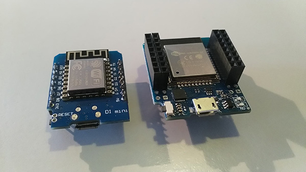

# Dice-Tower
**Create some interaction effects for your homemade Dice Tower.**

## Work in progress
This README.md needs to be enriched with photo's, images, etc. This is something I strive to add during the progress of the project.

## Short introduction
The Dice Tower project is a project where my good friend / ex-colleague Nico Jongsma (aka Axios, not a Github user) came up with. He wanted to build a Dice Tower himself. To get an idea of what a Dice Tower could look like please Google the term: <https://www.google.com/search?tbm=isch&q=dice+tower>

Nico doesn't have the knowledge of the electronics and programming. The more I explained which parts and skills are needed, the simpler the electronic part of the project should be according to Nico. For me it was more like a challenge to get the elektronics working in such a way that totally fits in his cool looking Dice Tower.

Nico wanted to build a Dice Tower which have a kind of skull on the front of the tower. In that skulls there will be placed 2 red leds as eyes which should blink when a dice is put in the tower. Then he wanted a campfire somehere on the object. This will be simmulated with 3 yellow leds (lights up as orange in my opinion). Then he wants to connect 4 miniature lanterns which should be permanantly lit. And finally he also wants to put 20 cold white leds in the tower which also should be lit permanently.

The things I added to the ideas of my colleague:
- A Wemos D1 mini to add interaction and animation effects to the Dice Tower. Later on in the project I added support for the MH-ET LIVE MiniKit ESP32 which has exactly the same pin layout as the Wemos D1 mini but has a ESP32 onboard instead of ESP8266 plus extra pins.
- A SW-18010P vibration sensor to detect the dice rolling through the tube of the Dice Tower.
- A configuration button.
- A configuration light (indicates whether a button press has been fetched or provide the status of things going on).
- A power-light to see whether the project gets powered correctly.
- A nice PCB design to flatten the space needed to drive all the leds. The original idea consisted of a main board with all connections to the leds soldered on it, then put a "interactive module" on top of that and at last a Wemos D1 mini or MH-ET LIVE MiniKit ESP32 on top of that. With a nice own designed PCB we got 1 layer less.

## Materials
### PCB
Ofcourse you can build the project on a prototype board but if you want a nice looking PCB you can let a PCB manafacturer create it. I have designed a PCB at [EasyEDA](https://www.easyeda.com). You can find it here: <https://easyeda.com/Joennuh/Dice-Tower> Currently you need revision 005. Wemos D1 mini's as well MH-ET LIVE ESP32 MIniKit's are supported. The Wemos D1 mini has fewer pins and thus it does support less functionality.

From [EasyEDA](https://www.easyeda.com) you can easily send the Gerber files to [JLCPCB](https://www.jlcpcb.com) without the need to download and upload the Gerber files. Manufacturing the PCB already does not cost a lot (we ordered both the main board and display module board for around €13,=) and you can select several colors nowadays.

I have no assocation to EasyEDA and JLCPCB and thus this explanation is not sponsored by EasyEDA nor JLCPCB.

### Development board
The heart of the machine is the Wemos D1 mini or the MH-ET LIVE MiniKit ESP32. Theoretically any Arduino campatible development board can drive the project but since I had quite a few Wemos D1 mini's lying around I decided to firstly stick with that board. Later on the MH-ET LIVE ESP32 MiniKit got my interest since it has the same pin layout and so I added support for this board to the project. Currently the project doesn't use the WiFi capability of the Wemos D1 mini and MH-ET LIVE ESP32 MiniKit but the advantage of the choice to use these 2 boards is that WiFi functions can be added easily later on.

Below is a photo of the 2 compatible Arduino boards. Click the photo to view a enlarged version of the photo.

On the left you see the Wemos D1 mini and on the right the MH-ET LIVE MiniKit ESP32.

### Leds and resistors
As long that you do not exceed the following limits you can use any led:
- Maxmimum 3.3V, 12 mA for the leds driven by the Wemos D1 mini (eyes, campfire and configuration/status led).
- Maxmimum 3.3V, 40 mA for the leds driven by the MH-ET LIVE ESP32 MiniKit (eyes, campfire leds, configuration led, status led, display indicator led, SMD leds)
- Maxmimum 3.3V for the power led (not driven by GPIO but still uses the 3.3V power of the Wemos D1 mini / MH-ET LIVE MiniKit ESP32).
- Maxmimum 5V for any other led.

As far as we found the data for it we do use the leds and resistors in the table below. We also specify to which power line it will be connected. On our prototype PCB we did use SMD leds for the continous power led and configuration led with other characteristics and thus we also used other resistors. Please see our [Prototype PCB Wiki page](https://github.com/Joennuh/Dice-Tower/wiki/Prototype-PCB) for that.

| Amount | Color          | Working voltage | Working current | Function                          | Power | Resistor |
| -----: | :------------- | :-------------- | :-------------- | :-------------------------------- | :---- | :------- |
| 3      | red            | 1.9 - 2.1 V     | 20 mA           | Eyes & power led                  | 3.3V  | 100 Ω    |
| 3      | yellow         | 1.9 - 2.1 V     | 20 mA           | Campfire                          | 3.3V  | 100 Ω    |
| 1      | green          | 1.9 - 2.1 V     | 20 mA           | Configuration / status led        | 3.3V  | 100 Ω    |
| 20     | cold white     | 3.0 - 3.2 V     | 20 mA           | Lights in the tower               | 5V    | 100 Ω    |
| 4      | warm white (1) | 3.1 V (1)       | 20 mA (1)       | Lanterns around collection bin    | 5V    | 100 Ω    |
| 1      | -              | -               | -               | Resistor for configuration button | 3.3V  | 4.7 kΩ   |

(1): The seller of the miniature lanterns did not specify the exact color, working voltage and working current. The seller only specified that it should operate on 3 to 5 volts. I assume it will be a warm white led with a working voltage of 3.1 and a working current of 20 mA.

And additional for the MH-ET LIVE ESP32 MiniKit with attached display module:

| Amount | Color          | Working voltage | Working current | Function                          | Power | Resistor |
| -----: | :------------- | :-------------- | :-------------- | :-------------------------------- | :---- | :------- |
| 1      | blue           | 3.0 - 3.2 V     | 20 mA           | Display indicator led             | 3.3V  | 22 Ω     |
| 1      | red            | 1.9 - 2.1 V     | 20 mA           | Power led                         | 3.3V  | 150 Ω    |
| 2      | -              | -               | -               | Resistors for down / up buttons   | 3.3V  | 4.7 kΩ   |

### Configuration & reset buttons
Any button could do but for the main PCB I have chosen for a sidewards 6 x 6 mm tactile button. Any depth of the button could do but I use the default one of 5 mm.

### Display module buttons
On the PCB layout for the display module I reserved room for a normal tactile momentary push button as select button and 2 sidewards tactile momentary push buttons as down and up buttons. We chose to use buttons not directly attached to the buttons but with wires so we can freely chose a position on our enclosure. To connect the wires for those seperate buttons I created an header pin connector cutout on the lower part of the display module PCB.

### Trigger
The trigger provides a signal to the D3 pin of the Wemos D1 mini or GPIO 17 pin of the MH-ET LIVE ESP32 MiniKit when a dice rolling through the tube of the Dice Tower has been detected. The trigger can be a anything that shorts the D3 pin of the Wemos D1 mini or GPIO 17 pin of the MH-ET LIVE ESP32 MiniKit to ground. This could be for example 2 pieces of aluminium hitting each other when a dice rolls on it. Me and my friend choose to use a SW-18010P vibration sensor to sens the vibration fot the dice through the tube. It's best to attach the vibration sensor on the outside of the tube somehwere on the almost the end of the tube. It is also best to leave some space around the end of the tube so that the tube can vibrate enough to let the vibration sensor detect vibrations.

### Header pins
There are several ways to connect all leds to the mainboard but on the PCB I designed have been decided in a way that you can choose to use pin headers (female or male). In that case you need a double row header. I would advise an easily breakable female double row header.

On the left side of the main PCB you can solder the wires of the leds directly to the PCB and thus you only need a double row 2 x 3 male header to populate the connections for the trigger pin and power. I think single row male pin headers are more easily to break and so you can decide to use 2 single rows 1 x 3 male headers. Ofcourse you can decide to solder dupont connectors to the led wires and attached that to male pin headers of the main PCB. In that case you'll need 1 double row 2 x 32 male header or 2 single row 1x 32 male headers.

For the Wemos D1 Mini / MH-ET LIVE ESP32 MiniKit it is advisable to use 2 double rows 2 x 10 female headers or 4 single row 1 x 10 female headers. On the Wemos D1 mini you can solder the default male pin headers delivered with your Wemos D1 mini (2 single rows 1 x 8 male header). On the MH-ET LIVE ESP32 MiniKit I would advice to solder 2 double rows 2 x 10 male headers.

### Wires
To connect the leds from somewhere in the tower to your board you'll also needs wires. Wrapping wire will do. It is advisable to use black and red wires to easily distinguish the negative and positive sides coming from the leds.

Ofcourse you also will need a micro-USB cable to power the board through the Wemos D1 mini.

### Heatshrink tubes
To protect the leads of the leds it is advisble to use some heatshrink tubes around the exposed leads. This is to prevent any accidental shortage.

### Screen
The screen we use for the display module is an OLED I2C SSD1306 0.96 inch 128 x 64 pixels.

### Display module connections
To connect the display module to the main PCB we use a serial DB9 connection. On the main PCB we use the male serial connector DB9 and on the display module we use the female serial connector DB9. The cable in between them is a default serial DB9 cable. NEVER CONNECT THE SERIAL CONNECTORS OF THE PCB'S TO A PC OR OTHER SERIAL DEVICE! RISK FOR SHORT CIRCTUIT AND DAMAGE!

## Software
The software can be downloaded from this Github repository under the GPL 3.0 license. Currently the software doesn't use WiFi capability of the Wemos D1 mini / MH-ET LIVE ESP32 MiniKit but this can be subject of change in the future.

### Startup
By default at startup all leds will go on and off one by one to test the leds. On the MH-ET LIVE ESP32 MiniKit  the eye leds will go on together instead of individually during the startup fase. During startup the onboard led of the Wemos D1 mini / MH-ET LIVE ESP32 MiniKit will stay on. On the MH-ET LIVE ESP32 MiniKit during startup the boot logo will be showed on the screen of the display module.

### Default program
After the selftest the yellow leds will start flickering at random intensity to simulate a campfire. The red leds of the eyes will stay lit permanently on a low intensity. When pin D3 of the Wemos D1 mini or GPIO 17 of the MH-ET LIVE MiniKit ESP32 got HIGH the red leds will blink a few times and they stay on for about 3 seconds. This can also be triggered by a short press on the configuration button which is connected to D5 on the Wemos D1 mini or GPIO 18 of the MH-ET LIVE MiniKit ESP32.

On the MH-ET LIVE ESP32 MiniKit you can configure several settings through the menu on the display module. Als (a) virtual dice(s) can be used on the display module.

### Configuration button
A short press on the configuration button will manually trigger the blinking red leds. The green configuration / status led will shortly blink to confirm the short press.

A long press on the configuration button will change to the "permanently lit program". The green configuration / status led will blink for a second after you released the button to confirm the long press.

The last button state is a double click which currently does nothing. The green configuration / status led will blink shortly twice to confirm the double click.

### Permanently lit program
In the permanently lid program the yellow leds will stop flickering and are permanently lit at full intensity. The red leds will be lit at low intenisty and are permanently lit at full intensity for about 3 seconds upon dice detection.

### Operating the display module
On the idle screen (dice detection or virtual dice) you can long press the select button to enter the menu.

After that:
* **Select - short press:** select / enter / edit
* **Select - long press:** back / exit
* **Up - short press:** up in menu / decrease value
* **Down - short press:** down in menu / increase value

The display indicator led will go out shortly after s hort pres son one of the display module buttons to confirm the short press. It will go out shortly twice to confirm a double press. At last it will go out a bit longer to confirm a long press.