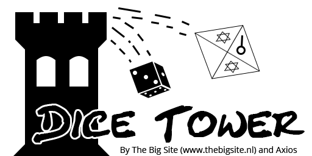

# Dice-Tower
**Create some interaction effects for your homemade Dice Tower.**

## Work in progress
This README.md needs to be enriched with photo's, images, etc. This is something I strive to add during the progress of the project.

## Short introduction
The Dice Tower project is a project where my good friend / ex-colleague Nico Jongsma (aka Axios, not a Github user) came up with. He wanted to build a Dice Tower himself. To get an idea of what a Dice Tower could look like please Google the term: <https://www.google.com/search?tbm=isch&q=dice+tower>

Nico doesn't have the knowledge of the electronics and programming. The more I explained which parts and skills are needed, the simpler the electronic part of the project should be according to Nico. For me it was more like a challenge to get the elektronics working in such a way that totally fits in his cool looking Dice Tower.

This resulted in this Dice Tower project / repository. This repository focuses only on the technical side of a Dice Tower. It doesn't explain how to build your tower. This repository and its Wiki only explains how our own designed PCB looks like, which components are used and how to use the software I have written.

## Compatible development boards

The following development are tested by my self for this project and are the target development boards I develop the software of the Dice Tower for.

### Basic functionality

The basic functionality consists of:
- Dice detection
- Blinking 2 eye leds on dice detection
- 3 flickering campfire led
- Option to toggle between blinking/flickering and steady lit leds
- Manually trigger dice detection

The development boards that are tested to be compatible with the basic functionality:
- Wemos D1 mini

The development boards that I expect to be compatible with the basic functionality:
- Wemos D1 mini pro

### Extended functionality

The extended functionality consists of:
- All the basic functionality's
- 2 SMD leds (currently acting as additional campfire leds)
- Option to connect a display module port with:
	- Animations on a display on boot and dice detection
	- Virtual dice(s)
	- 3 navigational buttons
	
The development boards that are tested to be compatible with the extended functionality:
- MH-ET LIVE ESP32 MiniKit

On the left you see the Wemos D1 mini and on the right the MH-ET LIVE MiniKit ESP32.

### Other development boards

Other development boards might be compatible with the Dice Tower. The best development boards would be the ones which has exactly the same form factor and pin layouts as the development boards mentioned above. Especially if you plan to use our designed PCB. Otherwise you might create an adapter plate to be able to connect the pins of your development board to the correct pins of our PCB.

Another option is to design your own PCB or prototype board.

Our [Pinmapping scheme](Dice-Tower/pinmapping.md) might be handy in these situations.

## Documentation
While some documentation is present in the [sketch files](Dice-Tower) most of the documentation can be found at [the WIki](https://github.com/Joennuh/Dice-Tower/wiki).

Feel free to contact me in one of these ways:
- [Gitter (prefered)](https://gitter.im/Dice-Tower/community)
- [Repository issue](https://github.com/Joennuh/Dice-Tower/issues)
- github ((at)) thebigsite ((dot)) nl
	- *Replace the ((...)) with their respective characters.*

## Making changes to the software

Feel free to modify the software as long as you respect the [GPL 3.0 license](https://github.com/Joennuh/Dice-Tower/blob/master/LICENSE) and the instructions in the [sketch file](Dice-Tower/Dice-Tower.ino) it self. It would be great if you notify me about your changes / version. I'm curious to see what other people make of my work.